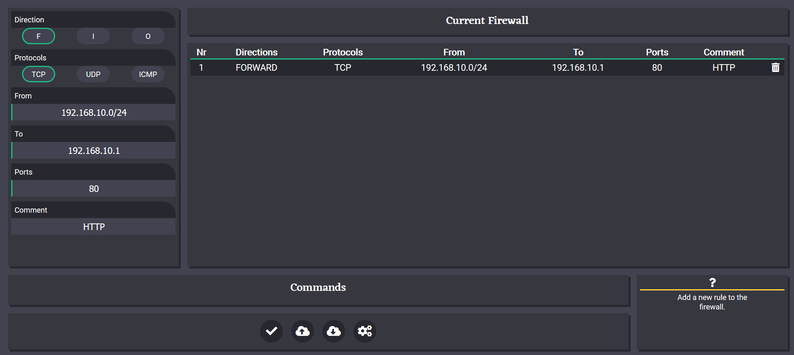

# FireWallBuilder
A wep application for building simple iptables firewalls.

## Prerequisites
* Python3
* The Python framework Flask
## Features
* Frontend written with html, js, css
* Style is an altered material design
* Firewall can be compiled so a shell script
## Upcomming
* Saving and loading firewalls with sqlite3

### Database structure

Table "Rules"

| Key | Attribute | Datatype |
| --- | --- | ---|
| PK | ruleID | interger |
| | title | text |
| | creationDate | integer |
| | directionBitmask | integer |
| | protocolBitmask | integer |
| | ipFrom | text | 
| | ipTo | text |
| | ports | text |
| | comment | text |
